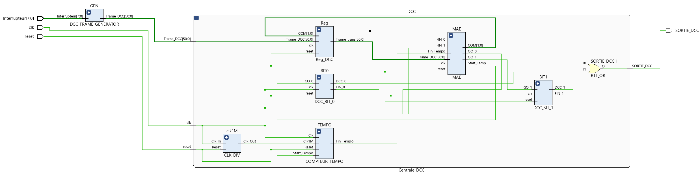
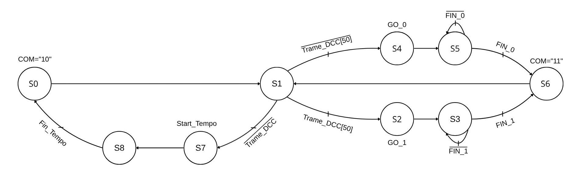
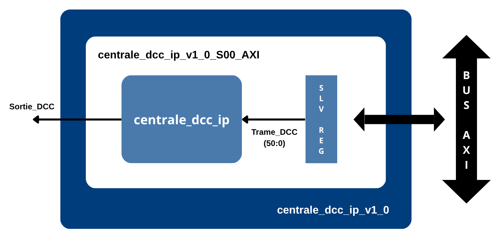
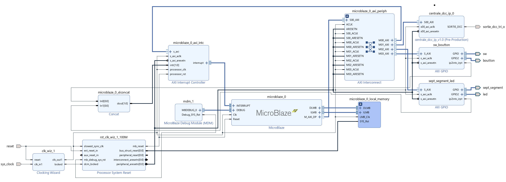
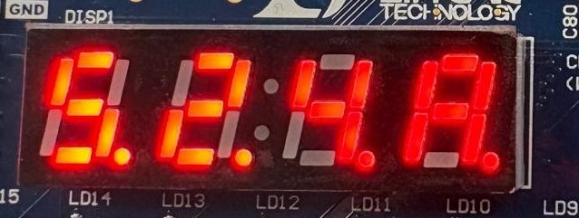
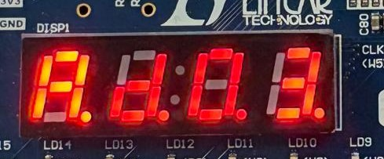
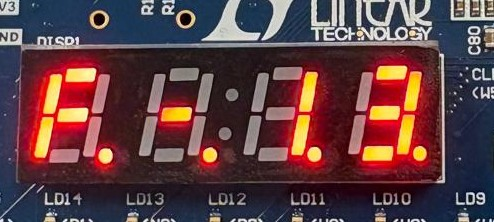

  

# Centrale DCC sur FPGA — UM4IN108 Systèmes Programmables
 
Réalisé par :
 
- Rabab Boudih — M1 SESI
- Rym Ben Brahim — M1 SAR
  
Ce projet a été réalisé dans le cadre de l'UE **Systèmes Programmables** du Master SESI de **Sorbonne Université**, sous la direction de Julien Denoulet et Amine Rhouni (mai 2026).
 
## Table des matières
 
- [Introduction](#introduction)
- [Matériel et outils](#matériel-et-outils)
- [Le protocole DCC](#le-protocole-dcc)
- [Conception matérielle (RTL)](#conception-matérielle-rtl)
- [Intégration dans un système MicroBlaze](#intégration-dans-un-système-microblaze)
- [Développement logiciel](#développement-logiciel)
- [Bonus : pilotage par accéléromètre](#bonus--pilotage-par-accéléromètre)
- [Validation et résultats](#validation-et-résultats
- [Conclusion](#conclusion)

---
## Introduction
 
L'objectif de ce projet est de concevoir une centrale de commande **DCC** sur FPGA, capable de contrôler plusieurs locomotives à partir d'une interface utilisateur, tout en respectant les contraintes temporelles du protocole.
 
Le projet se déroule en deux phases :
 
1. **Conception matérielle** : description en VHDL (niveau RTL) des modules qui génèrent et émettent les trames DCC, validés un par un par simulation.
2. **Intégration système** : packaging de la centrale en **IP**, intégration dans un système **MicroBlaze** via le bus **AXI**, puis développement d'un programme en C qui permet de piloter les trains avec les boutons, les interrupteurs et l'accéléromètre de la carte.
## Matériel et outils
 
- Carte **Basys 3** (FPGA Artix-7)
- Module accéléromètre **PmodACL2** (ADXL362), connecté au port JA de la carte
- Plateforme de trains pilotée en DCC
- **Vivado** : description VHDL, simulation, synthèse, création d'IP, block design
- **Vitis** : développement du logiciel embarqué en C

---
## Le protocole DCC
 
Le DCC est un standard ferroviaire qui transmet des commandes numériques aux locomotives via les rails. Chaque commande est envoyée sous forme de trame composée de quatre champs :
 
| Champ | Rôle |
|---|---|
| Préambule | Au moins 14 bits à 1 |
| Adresse | Identifie la locomotive |
| Commande | Vitesse, direction ou fonctions |
| Contrôle | Octet calculé par XOR pour détecter les erreurs |
 
Les bits sont codés par la durée des impulsions :
 
| Bit | Niveau bas | Niveau haut |
|---|---|---|
| 1 | 58 µs | 58 µs |
| 0 | 100 µs | 100 µs |
 
Les trames sont émises en continu, avec un intervalle de 6 ms entre deux trames.
 
## Conception matérielle (RTL)
 
La centrale est découpée en modules indépendants, chacun simulé avant l'assemblage final.
 

---
### Génération des bits
 
Deux modules, `DCC_BIT1` et `DCC_BIT0`, produisent respectivement un bit à 1 et un bit à 0 avec les durées exigées par le protocole. Ils reposent sur la même architecture : un diviseur d'horloge qui fournit une horloge à 1 MHz, un compteur qui mesure les demi-périodes et une machine à états qui commande le niveau de sortie. Seuls les paramètres temporels diffèrent.
 
### Registre DCC
 
Registre de 51 bits qui stocke la trame à émettre. Un signal de commande sur 2 bits permet de charger la trame complète, de la décaler d'un bit vers la gauche ou de conserver son contenu. Le bit de poids fort est transmis en premier, conformément au protocole.
 
### Machine à états globale
 
Elle pilote l'ensemble de la centrale : chargement de la trame dans le registre, lecture du bit courant, déclenchement du module `DCC_BIT0` ou `DCC_BIT1` correspondant, décalage du registre, puis temporisation de 6 ms une fois la trame entièrement transmise. Les sorties des deux générateurs de bits sont combinées pour produire le signal DCC final.
 

---
### Générateur de trames de test
 
Module temporaire qui sélectionne des trames prédéfinies (vitesse, klaxon, etc.) à partir des interrupteurs. Il a permis de valider toute la chaîne matérielle sur la plateforme trains avant l'intégration du MicroBlaze.
 
## Intégration dans un système MicroBlaze
 
### IP Centrale DCC
 
La centrale est packagée en IP avec l'outil de création d'IP de Vivado. Un **wrapper AXI** relie l'IP au bus : la trame de 51 bits est écrite par le processeur dans deux registres de 32 bits, puis transmise à la centrale. Le signal de reset, actif au niveau bas côté AXI, est adapté aux modules internes qui utilisent un reset actif au niveau haut.
 

---
### Block design
 
Le système complet est assemblé dans un block design Vivado :
 
- processeur **MicroBlaze** avec sa mémoire locale et son contrôleur d'interruptions
- **AXI Interconnect** reliant les périphériques au processeur
- IP **Centrale DCC** et IP **Accéléromètre**
- deux blocs **GPIO** : interrupteurs et boutons d'un côté, afficheur 7 segments et LEDs de l'autre
  

 
## Développement logiciel
 
Le programme embarqué en C, développé sous Vitis, est organisé en trois parties : construction et envoi des trames DCC (vitesse, fonctions F0 à F20), gestion de l'affichage 7 segments, et boucle principale qui gère l'interface utilisateur. La dernière trame validée est retransmise en permanence pour alimenter les trains en continu.
 
### Interface utilisateur
 
L'interface repose sur une machine à états à quatre étapes :
 
| Étape | Fonction | Commandes |
|---|---|---|
| 1. Adresse | Choix du train (1 à 7, ou 0 pour tous les trains) | Interrupteurs `SW2:SW0`, `btnR` pour valider |
| 2. Mode | Choix entre contrôle de la vitesse et des fonctions | `SW0` / `SW1`, `btnR` pour valider |
| 3. Vitesse | Réglage de la vitesse et de la direction | `btnU` / `btnD` (vitesse), `SW0` (direction), `btnC` (envoi), `btnR` (retour) |
| 4. Fonctions | Activation ou désactivation des fonctions F0 à F20 | `btnU` / `btnD` (navigation), `SW0` (on/off), `btnC` (envoi), `btnR` (retour) |
 
L'afficheur 7 segments indique en temps réel l'adresse, la vitesse avec le sens de marche, ou la fonction sélectionnée.
 

---
## Bonus : pilotage par accéléromètre
 
En complément du cahier des charges, l'accéléromètre **ADXL362** a été intégré au système. Ce bonus a été réalisé pour relever le défi et apporter une optimisation plus réaliste : conduire le train en inclinant la carte, sans passer par les boutons.
 
L'accéléromètre est encapsulé dans une IP AXI, à partir des modules SPI fournis. Le processeur lit les mesures des axes X, Y, Z et la température dans les registres de l'IP. Le logiciel exploite les axes X et Y :
 
| Axe | Condition | Action |
|---|---|---|
| X | Valeur > +300 | Le train accélère |
| X | Valeur < -300 | Le train ralentit |
| Y | Valeur > +300 | Marche avant |
| Y | Valeur < -300 | Marche arrière |
 
Une nouvelle trame est envoyée à chaque changement, avec un court délai entre deux envois pour éviter de saturer la centrale.
 
## Validation et résultats
 
Chaque module a été simulé, puis le système complet a été synthétisé et testé sur la carte.
 
| Critère | Résultat |
|---|---|
| Période d'un bit à 1 | 116 µs, conforme au protocole |
| Période d'un bit à 0 | 200 µs, conforme au protocole |
| Décalage du registre | Correct à chaque bit transmis |
| Temporisation entre trames | 6 ms respectés |
| Système complet | Validé sur la plateforme trains : vitesse, direction et fonctions |
| Accéléromètre | Contrôle de la vitesse et de la direction par inclinaison de la carte |
 
## Conclusion
 
Ce projet couvre l'ensemble de la chaîne de conception d'un système embarqué mixte matériel/logiciel : description RTL en VHDL, simulation et validation de chaque module, création d'IP avec wrapper AXI, intégration dans un système MicroBlaze, puis développement du logiciel de commande en C. Il a également permis de prendre en main une architecture existante (module accéléromètre) et de l'intégrer au système.
 
Le rapport complet, avec l'ensemble des simulations et schémas, est disponible dans [`rapport_projet.pdf`](rapport_projet.pdf).
